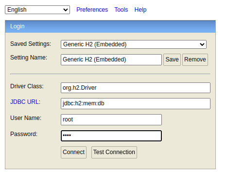
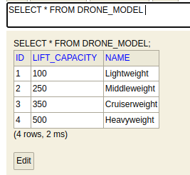

### Drones

### Stack
Framework: spring-boot

### Task
[task](Task.md)

### Prerequisites
- mvn
- docker
- docker compose

### Fast start
`mvn package && docker compose up -d`

### Stop application

`docker compose down`

### Swagger
Drones-server swagger-ui is available at:
http://localhost:9090/swagger-ui/index.html#/

You can use swagger-ui to execute requests to api server. 

### H2 console DB
Drones-server h2 db console is available at: http://localhost:9090/h2-console/

Drones-checker h2 db console is available at: http://localhost:9091/h2-console/

H2 db is configured to use in-memory type, after reloading docker containers, data is dropped.

### Preloaded Data
The only preloaded data is drone models dictionary:

### Scheduler

Scheduler is wrapped as a microservice with separate db,
cron job is configured with: `0 * * * * *`, job is executed every minute.
